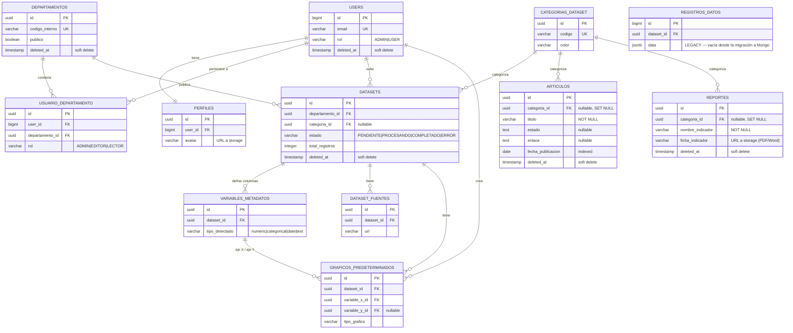

# Sistema Observatorio ULEAM — Arquitectura y Guía de Ejecución

> Documento generado el 2026-07-04, actualizado el mismo día tras un arranque en frío real y verificado. Es el mapa completo del sistema: estructura, arquitectura, cómo se integran PostgreSQL y MongoDB, y cómo levantarlo de punta a punta.

---

## 1. Visión general

Observatorio ULEAM es un sistema de gestión de datos universitarios: departamentos suben datasets (Excel/CSV) con estructura arbitraria, el sistema detecta tipos de columna automáticamente, genera estadísticas y visualizaciones, y expone un portal público de consulta. Además gestiona contenido editorial propio (artículos, reportes/indicadores).

**Monorepo con tres partes independientes:**

```
Observatirio/
├── backend/          Laravel 12 (PHP 8.4), arquitectura DDD en 4 capas
├── frontend/         Angular 21 standalone + SSR, patrón MVVM
├── scripts/          Helpers multiplataforma (.ps1 / .sh) — entrypoint canónico
└── docker-compose.yml   PostgreSQL 16 + MongoDB 7 (infra de datos)
```

**Persistencia políglota (la decisión de arquitectura central):**

| Motor | Rol | Por qué |
|---|---|---|
| **PostgreSQL 16** | Catálogo relacional y transaccional: usuarios, roles, departamentos, metadata de datasets, contenido editorial | Datos con esquema fijo, integridad referencial, transacciones ACID |
| **MongoDB 7** | Filas de datos de los Excel/CSV subidos (`registros_datos`) | Esquema variable — cada Excel tiene columnas distintas; forzarlo a SQL tipado requeriría migraciones por dataset |

PostgreSQL nunca almacena las filas de datos en sí (eso migró completamente a Mongo); solo describe *qué forma tienen* esas filas (`variables_metadatos`) y a qué dataset pertenecen.

---

## 2. Backend — Laravel 12, DDD en 4 capas

```
backend/app/
├── Domain/          Entidades, interfaces de repositorio, value objects. CERO deps de framework.
│   ├── Contenido/       (Articulo, Reporte)
│   ├── Dataset/         (Dataset, VariableMetadato, RegistroDatoRepositoryInterface, ...)
│   ├── Departamento/
│   ├── Shared/
│   ├── Statistics/      (StatisticsServiceInterface)
│   └── User/
├── Application/     Casos de uso + DTOs, uno por bounded context
│   ├── Auth/ Dashboard/ Dataset/ Departamento/ Profile/ Public/ User/
├── Infrastructure/  Implementaciones concretas
│   ├── Persistence/Eloquent/     → repos y modelos Postgres
│   ├── Persistence/Mongo/        → repo y modelo MongoDB
│   ├── Providers/RepositoryServiceProvider.php   ← EL BINDING CENTRAL
│   └── Services/     StatisticsService, TextProcessingService, ExcelReaderService
├── Presentation/    HTTP: Controllers/Api, Requests, Resources
└── Models/          Modelos Eloquent Postgres puros (usados solo por Infrastructure)
```

### El binding que decide qué motor usa cada dato

`app/Infrastructure/Providers/RepositoryServiceProvider.php` es el punto único donde se elige la implementación concreta de cada interfaz de dominio:

```php
public array $bindings = [
    DepartamentoRepositoryInterface::class      => EloquentDepartamentoRepository::class,   // Postgres
    DatasetRepositoryInterface::class           => EloquentDatasetRepository::class,          // Postgres
    RegistroDatoRepositoryInterface::class      => MongoRegistroDatoRepository::class,        // ← MongoDB
    VariableMetadatoRepositoryInterface::class  => EloquentVariableMetadatoRepository::class,  // Postgres
    UserRepositoryInterface::class              => EloquentUserRepository::class,             // Postgres
    StatisticsServiceInterface::class           => StatisticsService::class,                  // agrega sobre Mongo
];
```

El resto de la aplicación (casos de uso, controllers) programa contra la **interfaz** `RegistroDatoRepositoryInterface`, nunca contra Eloquent o Mongo directamente. Esto es lo que permitió migrar el almacenamiento de filas de JSONB (Postgres) a MongoDB **sin tocar ningún caso de uso** — solo se cambió el binding y se escribió la nueva implementación.

### Rutas — modulares, no monolíticas

`routes/api.php` es un manifiesto delgado; las rutas reales viven en `routes/modules/*.php`:

```
auth · datasets · stats · publico · users · variables
departamentos · categorias · fuentes · graficos · seed · profile
articulos · reportes
```

74 rutas API en total. Patrón de cada módulo: `Route::get/post(...)` públicos fuera de middleware; mutaciones (`POST/PUT/DELETE`) dentro de `Route::middleware(['auth:sanctum', 'role:ADMIN'])`. `/api/publico/*` es el portal sin autenticación.

### Roles (dos niveles)

- **Global** — `users.rol`: `ADMIN` | `USER`. Enforced por middleware `CheckRole` (`role:ADMIN`).
- **Por departamento** — pivot `usuario_departamento.rol`: `ADMIN` | `EDITOR` | `LECTOR`. Un usuario puede tener distinto rol en distintos departamentos.

Auth vía Laravel Sanctum, pero **con Bearer token** (no cookies de sesión) — el login devuelve `{ user, token }` y el frontend lo guarda en `localStorage`, adjuntándolo como `Authorization: Bearer <token>` en cada request (`authInterceptor`). Esto importa para el punto 7.5: la restricción de acceso cruzado entre frontend y backend la maneja **CORS**, no `SANCTUM_STATEFUL_DOMAINS`.

---

## 3. PostgreSQL — esquema relacional completo (20 tablas)

Verificado en vivo contra `observatorio_db` (puerto 5433, DB `observatorio_uleam`).

### Dominio propio (11 tablas)



`registros_datos` existe todavía en Postgres como **ruta de rollback** (el SDD de integración Mongo la conserva a propósito), pero ya no se escribe activamente — todo dato nuevo va a MongoDB.

### Framework (9 tablas, Laravel)

`migrations · cache · cache_locks · jobs · job_batches · failed_jobs · sessions · password_reset_tokens · personal_access_tokens`

### Convenciones

- UUID como PK en todo excepto `users` (bigint autoincremental — decisión histórica de Sanctum/Breeze).
- Soft deletes (`deleted_at`) en las tablas de dominio principales — nada se borra físicamente.
- FKs hacia `categorias_dataset` son `nullable` con `ON DELETE SET NULL` — borrar una categoría no destruye el contenido que la usaba.

---

## 4. MongoDB — almacén documental (persistencia políglota)

**Qué hay realmente ahí:** database `observatorio_nosql`, **una sola colección** `registros_datos`, discriminada por `dataset_id`.

> Nota de diseño: el SDD original (`docs/SDD-Integracion-MongoDB.md`) proponía una colección por dataset (`ds_<uuid>`, "Opción A"). La implementación real optó por una única colección `registros_datos` con el campo `dataset_id` como discriminador ("Opción B" del mismo documento) — más simple de operar, con un índice `{dataset_id: 1}` para acotar cada query a su dataset. Si el documento SDD se lee como referencia de diseño, tener en cuenta que esta es la decisión que realmente se implementó.

### Forma del documento

```json
{
  "_id": "ObjectId(...)",
  "dataset_id": "019ef85c-7dd7-7259-af69-bd71790f5d67",
  "data": {
    "ph": 7.6,
    "temperatura": 32,
    "punto_muestreo": "Tramo urbano",
    "fecha_medicion": "2024-09-17"
  },
  "created_at": "2026-07-03T12:06:40.695Z"
}
```

Los valores dentro de `data` se guardan con **tipos BSON nativos** (`double` para pH, no string) — eso es lo que permite que las agregaciones de Mongo (`$avg`, `$isNumber`, rangos) funcionen sin castear en cada query.

### Cómo se conecta desde Laravel

Paquete `mongodb/laravel-mongodb ^5.8`. Conexión declarada en `config/database.php`:

```php
'mongodb' => [
    'driver'   => 'mongodb',
    'dsn'      => env('MONGODB_URI', 'mongodb://127.0.0.1:27017'),
    'database' => env('MONGODB_DATABASE', 'observatorio_nosql'),
],
```

Modelo Eloquent-style: `App\Infrastructure\Persistence\Mongo\Models\RegistroDatoMongoModel`.

> ⚠️ **Gotcha ya resuelto en este repo:** `mongodb/laravel-mongodb` v5.x **ignora** la propiedad `$collection` — solo respeta `$table` (el nombre estándar de Eloquent) para nombrar la colección. Si alguna vez ves `protected $collection = '...'` en un modelo Mongo de este proyecto, es un bug: Eloquent va a auto-derivar el nombre de colección desde el nombre de la clase en su lugar, y los inserts van a terminar en una colección equivocada sin ningún error visible.

### Quién escribe y quién lee

| Pieza | Rol |
|---|---|
| `MongoRegistroDatoRepository` (implementa `RegistroDatoRepositoryInterface`) | CRUD de filas: `insertBatch`, `deleteByDatasetId`, `countByDatasetId`, `findByDatasetIdPaginated` |
| `ConfirmImportUseCase` | Al confirmar la importación de un Excel, inserta las filas en lotes de 500 vía el repositorio |
| `StatisticsService` (implementa `StatisticsServiceInterface`) | **No pasa por el repositorio** — construye sus propios `Aggregation Pipeline` directamente contra `RegistroDatoMongoModel` para calcular: media/min/max/std/mediana, histogramas, frecuencias categóricas, scatter, tablas de contingencia, series de tiempo |
| `php artisan datasets:migrar-a-mongo` | Comando idempotente de backfill Postgres → Mongo (por dataset o `--dry-run`) — ver §7.4 |

### Seguridad de las queries a Mongo

Los nombres de columna que llegan del usuario (vía filtros, ejes de gráficos) se sanitizan antes de interpolarse en un pipeline: `sanitizeColumn()` rechaza cualquier cosa que no sea texto imprimible, y como nunca se concatenan a un string de query (siempre son *field paths* estructurados dentro de arrays PHP → BSON), no hay superficie de inyección NoSQL vía operadores `$`.

### Health check

`GET /api/health` es deliberadamente liviano (sin DB) para el warmup gate del frontend en cold-starts de Render. `GET /api/health?deep=1` sí verifica conectividad real a ambos motores:

```json
{ "ok": true, "ts": "...", "services": { "postgres": "ok", "mongodb": "ok" } }
```

---

## 5. Frontend — Angular 21, MVVM + Signals

```
frontend/src/app/
├── core/
│   ├── services/       ApiService, AuthService, DashboardService, DatasetService,
│   │                   DepartamentoService, UserService, ProfileService, CategoriaService,
│   │                   ThemeService, LanguageService, ChartThemeService, BackendWarmupService
│   ├── interceptors/    authInterceptor (adjunta token Sanctum, maneja 401/403)
│   │                   retryInterceptor (backoff exponencial tras el warmup gate)
│   └── guards/          authGuard · guestGuard · adminGuard · roleGuard(roles)
├── presentation/viewmodels/   AuthViewModel · DashboardViewModel · DatasetAnalysisViewModel
├── features/            auth · dashboard · datasets · departamentos · usuarios · profile · public
├── shared/               main-layout, charts/*, variable-analysis, text-insights-panel, ...
└── routes/               admin.routes.ts · auth.routes.ts · public.routes.ts → app.routes.ts
```

**MVVM real, no solo nominal:** los componentes de feature no llaman servicios HTTP directo — delegan a un ViewModel (`DatasetAnalysisViewModel`, `AuthViewModel`, `DashboardViewModel`) que expone estado como **signals** (`signal`, `computed`) en vez de Subjects RxJS. Los servicios `core/` sí usan RxJS para las llamadas HTTP crudas; el ViewModel es la capa que traduce eso a signals para la vista.

**Árbol de rutas** (`app.routes.ts`):
- `/` → landing pública
- `/publico/*` → portal sin auth (departamentos, datasets, análisis de variable, "barómetro")
- `/auth/*` → login/register (`guestGuard`)
- `/admin/*` → detrás de `authGuard`, dentro de `MainLayoutComponent` (sidebar + header); mutaciones detrás de `adminGuard`
- `/perfil` → detrás de `authGuard`

**Confirmado explícitamente:** el frontend **todavía no tiene** servicios, componentes ni rutas para `articulos` / `reportes` (los módulos de contenido nuevos) ni ninguna integración directa con MongoDB — el backend ya expone esos endpoints REST, pero el consumo desde Angular está pendiente como siguiente slice natural.

**Environments:** `environment.ts` → `http://localhost:8000/api` (dev); `environment.prod.ts` → `https://observatirio.onrender.com/api`.

---

## 6. Flujo end-to-end (subir un Excel y verlo graficado)

```
1. POST /api/datasets                    → crea Dataset (Postgres, estado PENDIENTE)
2. POST /api/datasets/{id}/analyze       → ExcelReaderService detecta tipos de columna (muestra 100 filas)
3. (usuario ajusta tipos en el frontend, si hace falta)
4. POST /api/datasets/{id}/import        → ConfirmImportUseCase:
                                             4.1 persiste VariableMetadato × columna (Postgres)
                                             4.2 inserta filas en lotes de 500 (MongoDB, vía MongoRegistroDatoRepository)
                                             4.3 marca Dataset COMPLETADO + total_registros (Postgres)
5. GET  /api/datasets/{id}/graficos-predeterminados   → definiciones de gráfico (Postgres)
6. POST /api/stats/univariable | /bivariable          → StatisticsService agrega en vivo sobre MongoDB
7. Angular (ECharts) renderiza con los datos agregados
```

Ningún paso requiere una transacción distribuida Postgres↔Mongo: si la escritura a Mongo falla, el dataset queda en estado `ERROR` en Postgres (patrón *saga* ligero, sin compensación automática todavía).

---

## 7. Guía de ejecución — cómo levantar el proyecto

### 7.1 Prerrequisitos

- **Docker Desktop** corriendo (Postgres + MongoDB viven ahí).
- **Bun** (preferido) o **npm** para el frontend — el repo detecta cuál tenés instalado.
- Para la ruta "backend nativo en host": **PHP 8.4** + **Composer**. Para la ruta recomendada (backend en Docker) no necesitás PHP en el host.

### 7.2 Arranque desde cero (clon nuevo del repo)

**Opción recomendada — backend dentro de Docker, sin instalar PHP en el host:**

```powershell
cd Observatirio

# 1. Bases de datos
docker compose up -d                      # Postgres (5433) + MongoDB (27017)

# 2. Backend
.\scripts\backend.ps1 install             # build de la imagen: composer install + ext. mongodb + código
.\scripts\backend.ps1 migrate-fresh-seed  # crea el esquema (21 migraciones) y siembra datos de demo
.\scripts\backend.ps1 start                # Laravel arriba en :8000, corriendo en Docker

# 3. Llevar los registros del seed a MongoDB (el seeder los inserta en Postgres JSONB;
#    la app los lee desde Mongo, así que hay que migrarlos una vez)
docker exec observatorio-backend-dev php artisan datasets:migrar-a-mongo

# 4. Frontend (proceso nativo en el host, no containerizado)
.\scripts\frontend.ps1 install
.\scripts\frontend.ps1 start               # ng serve, puerto 4200 por defecto
```

**Opción alternativa — todo con un solo script (backend nativo, requiere PHP 8.4 + Composer en el host):**
```powershell
cd Observatirio
.\scripts\start.ps1 setup   # instala deps backend+frontend, migra BD
.\scripts\start.ps1 all     # docker (Postgres+Mongo) + backend (php -S) + frontend (bun)
```

El backend en Docker resuelve `DB_HOST` y `MONGODB_URI` a `host.docker.internal` automáticamente (reescritos en runtime por los scripts) para alcanzar los contenedores de datos publicados en el host — no hace falta editar `.env` a mano para esto.

### 7.3 Arranque del día a día (todo ya instalado)

```powershell
docker compose up -d              # si Postgres/Mongo estaban parados
.\scripts\backend.ps1 start
.\scripts\frontend.ps1 start
```

Acceso: **http://localhost:4200** — login `admin@uleam.edu.ec` / `Admin12345` (credenciales del `AdminUserSeeder`, configurables en `backend/.env` vía `ADMIN_EMAIL` / `ADMIN_PASSWORD`).

### 7.4 Migrar registros existentes de Postgres a MongoDB

Necesario después de cualquier `migrate:fresh --seed` (el seeder de demo inserta filas directo en la tabla legacy `registros_datos` de Postgres, no en Mongo) o si restaurás un backup viejo:

```powershell
docker exec observatorio-backend-dev php artisan datasets:migrar-a-mongo --dry-run   # ver el plan sin escribir nada
docker exec observatorio-backend-dev php artisan datasets:migrar-a-mongo             # ejecutar (idempotente, seguro de re-correr)
```

Si volvés a correr `migrate:fresh --seed` más adelante, los datasets se recrean con **UUIDs nuevos** — los documentos viejos en Mongo quedan huérfanos (apuntando a un `dataset_id` que ya no existe). El comando de migración no los borra automáticamente porque no sabe cuáles son "viejos"; si querés limpiarlos:

```javascript
// dentro de mongosh, contra la db observatorio_nosql
const validIds = db.getSiblingDB('observatorio_uleam') // (esto es conceptual: los ids válidos salen de Postgres, no de Mongo)
db.registros_datos.deleteMany({ dataset_id: { $nin: [/* ids vigentes en la tabla datasets de Postgres */] } })
```

### 7.5 ⚠️ Gotcha real ya encontrado: puerto del frontend distinto a 4200 rompe CORS

Si en tu máquina el puerto **4200 está ocupado por otro proyecto** (pasó en esta máquina: un backoffice Angular no relacionado lo ocupaba) y levantás el frontend de Observatorio en otro puerto (ej. `ng serve --port 4300`), la app **carga pero todos los contadores/datos quedan en 0** — no es un error visible, es CORS bloqueando la request en el navegador sin que el componente lo reporte.

**Causa:** `backend/config/cors.php` tiene una lista blanca (`allowed_origins`) que por defecto solo incluye `http://localhost:4200` (y `:4000`). Cualquier otro origen se bloquea silenciosamente.

**Fix:** agregar el puerto real que estés usando a `allowed_origins` en `backend/config/cors.php`, y si el backend corre en Docker, **reconstruir la imagen** (`.\scripts\backend.ps1 install`) para que el cambio persista — un `docker exec` + edición en caliente del archivo dentro del contenedor funciona para probar rápido, pero se pierde en el próximo rebuild.

```php
// backend/config/cors.php
'allowed_origins' => [
    'http://localhost:4200',
    'http://localhost:4300',   // agregar el puerto real que uses
    // ...
],
```

Después de tocar `cors.php` dentro de un contenedor ya corriendo (sin rebuild), limpiar la cache de config para que tome efecto en la próxima request:
```powershell
docker exec observatorio-backend-dev php artisan config:clear
```

### 7.6 URLs de referencia

| Servicio | URL |
|---|---|
| Frontend | http://localhost:4200 (o el puerto que hayas usado — ver §7.5 si no es 4200) |
| API | http://localhost:8000/api |
| Swagger UI | http://localhost:8000/api/docs |
| Health (simple) | http://localhost:8000/api/health |
| Health (profundo, PG+Mongo) | http://localhost:8000/api/health?deep=1 |
| PostgreSQL | localhost:5433 (`postgres` / `secret123` / `observatorio_uleam`) |
| MongoDB | localhost:27017 (`root` / `secret123`, db `observatorio_nosql`) |

### 7.7 Cómo confirmar que todo levantó bien (checklist rápido)

```powershell
curl http://localhost:8000/api/health?deep=1        # → {"ok":true,...,"services":{"postgres":"ok","mongodb":"ok"}}
curl http://localhost:8000/api/publico/departamentos # → array con departamentos reales, no []
```

Si el segundo comando devuelve `[]` estando el primero en `ok`, el problema no es de datos ni de Mongo — es casi seguro CORS (§7.5) o que el frontend esté apuntando a otra `apiUrl` en `environment.ts`.

---

## 8. Pendientes conocidos (fuera de alcance de este documento, registrados para no perderlos)

- **Bug de presentación en histogramas:** `StatisticsService::getNumericStats()` calcula bien los conteos por bin pero les asigna la misma etiqueta de rango a todos — en investigación como tarea separada.
- **Frontend de Artículos/Reportes:** el backend ya expone `articulos` y `reportes` (CRUD + upload de fichas PDF), pero Angular no tiene todavía servicios/componentes para consumirlos — es el siguiente slice natural.
- **`registros_datos` en Postgres:** tabla legacy conservada como rollback; podría limpiarse una vez se valide que la migración a Mongo es estable en producción.
- **CORS whitelist estática:** si el puerto del frontend cambia con frecuencia en desarrollo (por conflictos con otros proyectos en la misma máquina), conviene evaluar permitir un patrón `http://localhost:*` solo en `local`/`development` en vez de listar puertos uno por uno.
